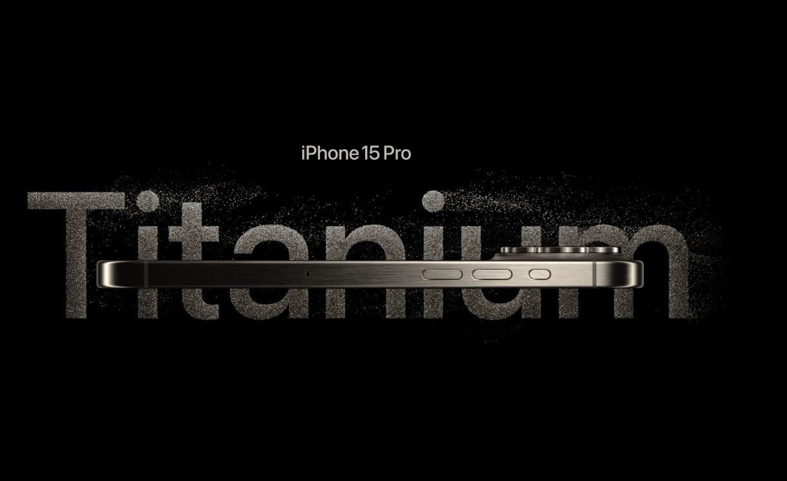

# [iPhone-Clone](https://iphone-clone.kyledlong.com)

This project aims to clone the iPhone 15 pro [website](https://www.apple.com/au/iphone-15-pro/)
<br>




## Tech

|                   |               |
| ----------------- | ------------- |
| React Three Fiber | Three.js      |
| JS                | Tailwind      |
| HTML              | Github actions|
| Vite              | Hostinger     |


<br>

This project is a basic static website created using HTML, CSS, and JavaScript. For package management and development server, we use npm as the Node Package Manager along with Vite. The Continuous Integration (CI) process involves automatically building artifacts from the main branch into the build branch whenever changes are pushed. This is achieved through GitHub Actions. Additionally, we have configured a webhook to send a POST request to a specified URL (in this case, Hostinger). As a result, any updates pushed to the main branch will trigger a build and update the production site accordingly. 

<br>

## How to Use
<br>

1. Clone the repository:

```bash
git clone https://github.com/KD-Long/iphone-clone.git
```

2. Install the dependencies:

```bash
cd iphone-clone
npm install
```

3. Run the project:

```bash
npm run dev
```

3. Open your web browser and navigate to http://localhost:3000 to access the project.


